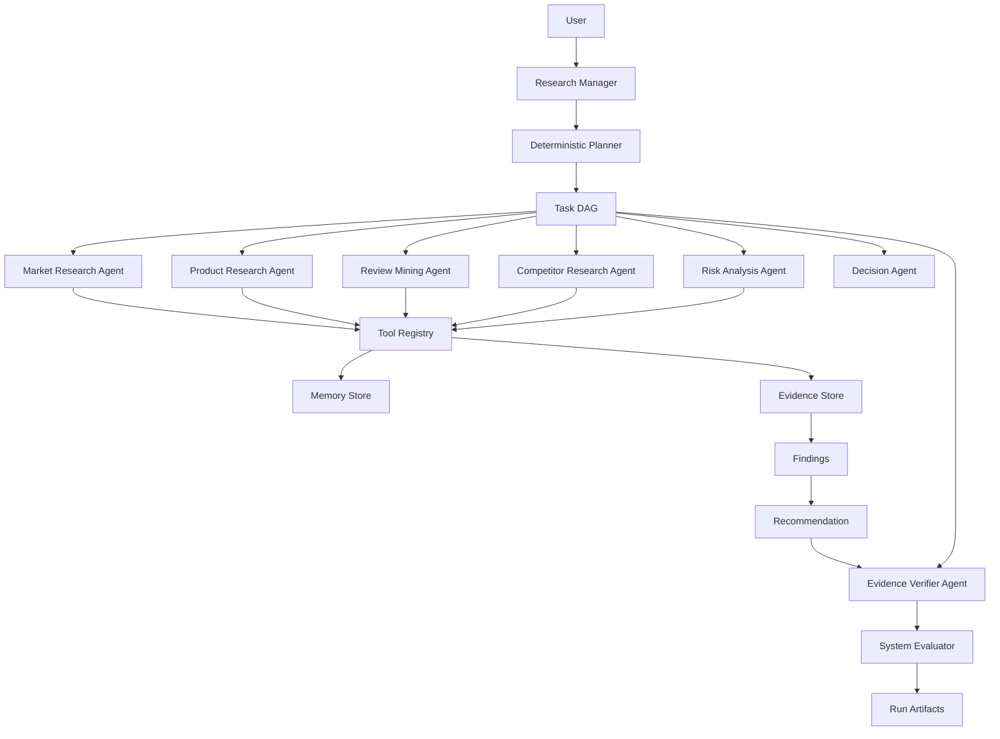
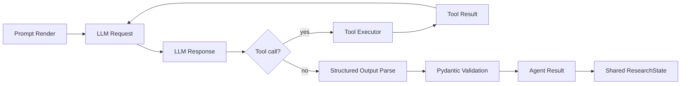
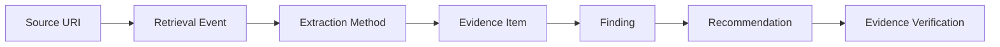

# MarketPilot Architecture

## Current scope

MarketPilot Step 2 is a provider-neutral LLM runtime built on the Step 1 offline architecture foundation. It keeps the typed domain contracts, task DAG, shared blackboard, evidence provenance, memory interfaces, trajectory logging, and structural evaluation, and adds typed LLM requests, structured outputs, a bounded tool loop, usage accounting, a retry policy, a deterministic fake provider, and one OpenAI adapter.

The dependency direction remains:

```text
Domain
   ↑
Agents
   ↑
LLM abstraction
   ↑
Provider adapters
```

Provider SDK objects never appear in `domain/`.

Step 3 adds a provider-neutral research boundary:

```text
ResearchTool
  → Provider Adapter (search / retrieval)
  → SourceRecord / RetrievalRecord / SourceSnapshot
  → EvidenceItem
  → Finding
  → Recommendation
```

Research modes are `mock`, `live`, and `replay`. Replay mode is strict and never falls back to the network.

## System context



## Agent execution lifecycle

```mermaid
flowchart LR
    Task[Task] --> Agent[Agent]
    Agent --> Tool[Tool]
    Tool --> Observation[Normalized Observation]
    Observation --> Evidence[Evidence]
    Evidence --> Finding[Finding]
    Finding --> State[Shared ResearchState]
    State --> Decision[Decision]
    Decision --> Verification[Evidence Verification]
    Verification --> Evaluation[Evaluation]
    Evaluation --> Trajectory[Trajectory Event]
```



For LLM-backed agents the lifecycle is:



The tool loop is bounded by configurable `max_model_turns` and `max_tool_calls`.

## LLM runtime boundary

`src/marketpilot/llm/` defines:

- normalized request, response, message, tool-call, usage, and model-config models
- a `LLMClient` abstract contract
- typed provider errors
- a bounded retry wrapper
- provider-neutral pricing
- a client registry
- a deterministic scripted mock provider
- an OpenAI chat-completions adapter

Prompt templates live in `src/marketpilot/prompts/` with `name`, `version`, and a deterministic SHA-256 hash. The hash is recorded in trajectory metadata alongside provider and model names.

## Structured output

LLM agents return JSON matching a Pydantic output model. Malformed JSON, missing fields, invalid enums, and schema violations are converted to `LLMStructuredOutputError` and rejected before any mutation of `ResearchState`.

## Metrics and cost

LLM calls, input/output/total tokens, latency, estimated cost, failed calls, and retries are aggregated into the run-level `ExecutionMetrics`. Cost is provider-neutral: if no price is configured, estimated cost remains `None` rather than an invented value.

## Tool calling

The LLM never calls Python functions directly. A normalized `LLMToolCall` is routed through the existing `ToolExecutor` and `ToolRegistry`, so the Step 1 tool boundary remains authoritative.

Every meaningful action produces a typed event. The event stream is separate from human-readable runtime logs.

## Coordination model

MarketPilot uses:

```text
Task DAG
+ Shared ResearchState
+ Evidence Store
+ Structured Events
```

It does not use free-form agent chat as the primary coordination mechanism. This choice reduces token noise, makes state transitions explicit, improves auditability, and makes replay deterministic.

## Evidence chain



Each `EvidenceItem` records:

- source type and URI
- retrieval timestamp
- content hash
- normalized excerpt
- confidence
- related entity
- extraction method
- related tool call

The shared state rejects findings that reference missing evidence and recommendations that reference missing findings, evidence, or risk flags.

## Run artifacts

Each run writes:

```text
runs/<run_id>/
├── trajectory.jsonl
├── final_state.json
└── summary.json
├── sources.jsonl
├── report.html
└── replay.jsonl (when a live or mock research run records)
```

`trajectory.jsonl` is append-only and ordered by sequence number. `final_state.json` contains the complete shared blackboard after evaluation. `summary.json` contains a compact human-facing result. `sources.jsonl` contains normalized source, retrieval, and snapshot provenance records. `report.html` is a self-contained static visualization.

## Future evolution

```text
Step 2:
provider-neutral LLM runtime + real agent execution

Step 3:
real web research tools

Step 4:
persistent PostgreSQL + pgvector memory

Step 5:
reflection + verifier loops

Step 6:
benchmark and synthetic task environment

Step 7:
trajectory learning / Agentic RL
```
