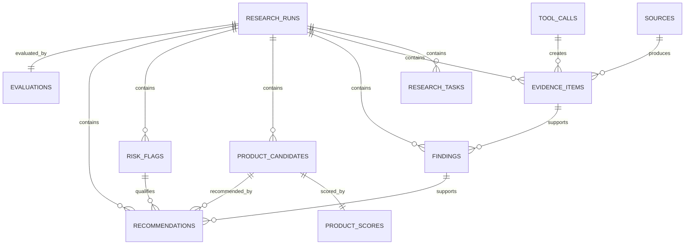

# Data Model

The persistence layer targets PostgreSQL and pgvector in a later phase. Step 1 defines SQLAlchemy models but does not require a live database.

## Logical entities

| Entity | Responsibility |
| --- | --- |
| `research_runs` | One complete research execution and its goal |
| `research_tasks` | DAG nodes and lifecycle state |
| `agent_events` | Ordered trajectory events |
| `tool_calls` | Structured tool invocations and outcomes |
| `sources` | Deduplicated source URIs |
| `evidence_items` | Normalized observations with provenance |
| `findings` | Evidence-backed analytical claims |
| `product_candidates` | Provider-neutral candidates |
| `product_scores` | Normalized score dimensions |
| `risk_flags` | Structured risks |
| `recommendations` | Evidence-grounded decisions |
| `memories` | Working, episodic, semantic, and skill memory |
| `evaluations` | Evaluation checks and metrics |
| `sources` (runtime) | Logical source identity |
| `retrievals` (runtime) | One retrieval attempt |
| `source_snapshots` (runtime) | Immutable normalized content at retrieval time |

## Relationships



## Likely indexes

- `research_runs(market, category)`
- `research_tasks(run_id, status)`
- `agent_events(run_id, sequence_number)` unique
- `tool_calls(run_id, tool_name, status)`
- `evidence_items(content_hash)`
- `evidence_items(source_id)`
- `findings(run_id)`
- `product_candidates(run_id, market, category)`
- `recommendations(run_id, decision)`
- `memories(scope, key)`

## Run lifecycle

```text
CREATED
  -> RUNNING
  -> COMPLETED | FAILED | CANCELLED
```

Task lifecycle:

```text
PENDING
  -> READY
  -> RUNNING
  -> SUCCEEDED | FAILED

FAILED
  -> READY
  -> RUNNING
  -> SUCCEEDED | FAILED

PENDING/READY
  -> BLOCKED
```
